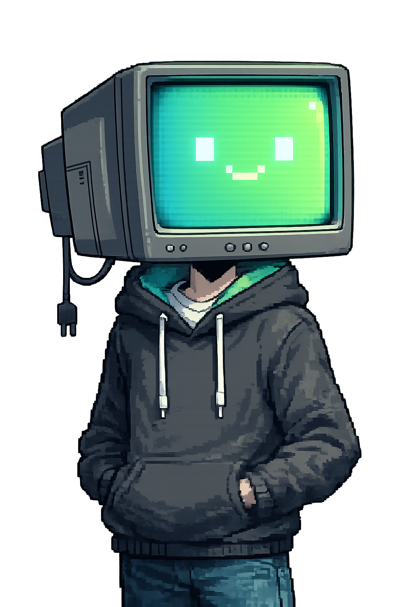
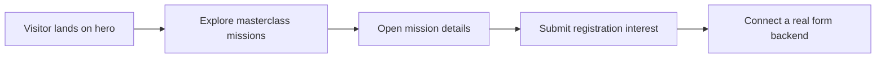

# AI Verse Website


A responsive, single-page pixel-art website for the AI Verse live masterclass series.

<p align="center">
  
</p>



## Included

- Original pixel-art hero scene
- Responsive desktop and mobile navigation
- Masterclass mission cards
- Mission detail dialogs
- Animated starfield, scanlines, ticker, and reveal effects
- Local registration form interaction with validation
- Accessible semantic markup and reduced-motion support
- No build step or framework required

## Run locally

Open `index.html` directly, or serve the folder:

```bash
python3 -m http.server 8080
```

Then visit `http://localhost:8080`.

## Deploy

Upload the folder to Netlify, Vercel, Cloudflare Pages, or GitHub Pages. Since it is a static site, no build command is needed.

### Vercel

The Vercel CLI is the quickest way to publish this site:

```bash
vercel login
vercel --prod
```

Choose the project name when prompted. Vercel detects the site as static and serves `index.html` from the project root.

## Connect the form

The current form is a polished front-end demo. Replace the submit handler in `script.js` with your Formspree, Tally, Google Apps Script, Supabase, or custom API endpoint when you are ready to collect registrations.

## Customize

The main content is in `index.html`. Colors and visual tokens are at the top of `styles.css` under `:root`.
